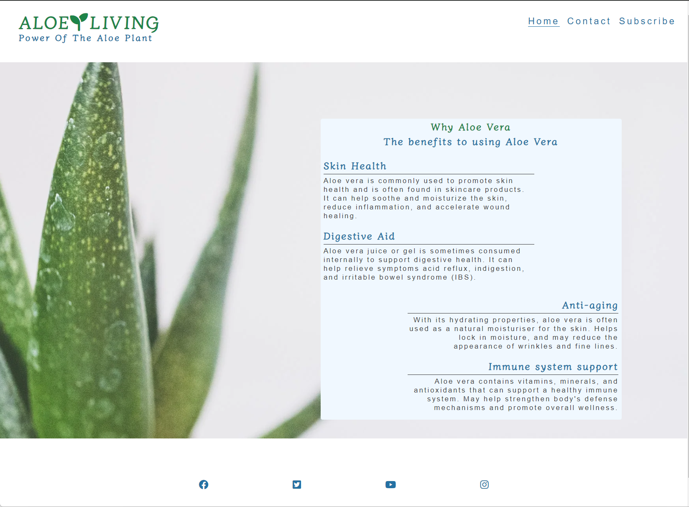
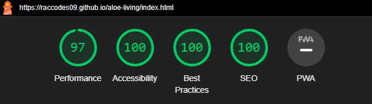

# ALOE LIVING

[Live webpage](https://raccodes09.github.io/aloe-living/index.html)

## Project Overview

Aloe Living is a website designed to inform users of the benfits of using Aloe Vera. It informs the user how Aloe Vera can be used in many differnt forms.

## Features

Benefits of Aloe Vera use
Contact deatils
Sign up form
Images of ALoe Vera

## Testing

## Performance

Using Google Lighthouse within Google Chrome Developer Tools I was able to test the performance, accessibility, best practice and SEO. The results shown below:

## Bugs

When screen size reduces to approximately tablet size and below, the Footer blends with body. Working with "sticky footer" coding I have attempted to fix the footer below each section, howvever my attempts have not worked. To resolve this, I will have to style the body in a differnet way.

## Validator Testing

## Deployment

## Credits

### Content

Code from social media links was taken from CI Love Running project

Code from hero image zoom was taken from CI Love Running project

### Media

Hero image taken from Pexels
